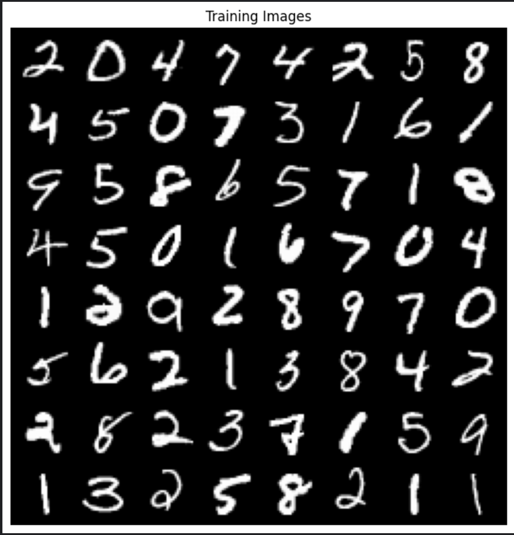
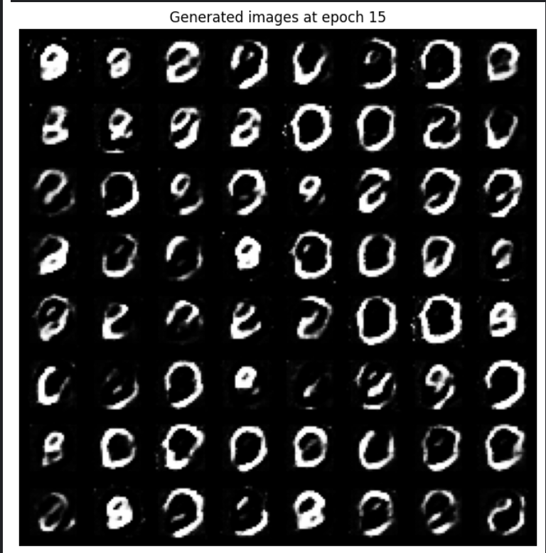
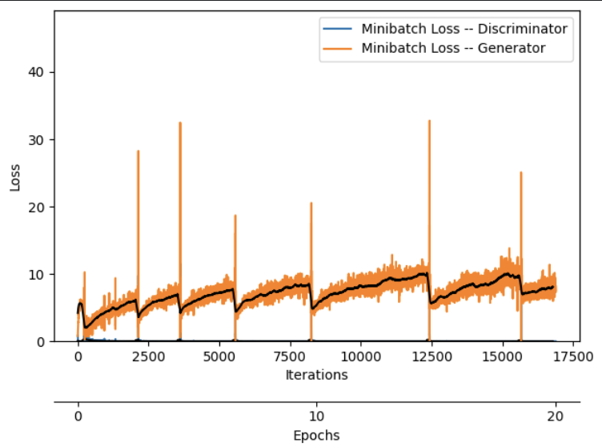
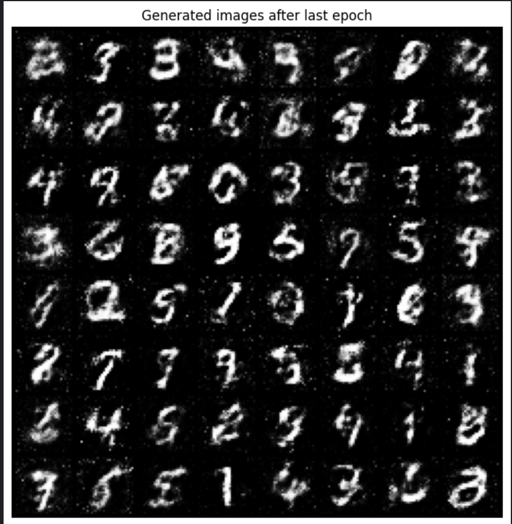

GAN is generative adversial network, which was a SOTA in generative tasks(before DIFFUSION MODELS) 

It is inspired by game theory and it has two networks: 
- DISCRIMINATOR($D$)
- GENERATOR($G$) 

D and G plays a min-max game to reach nash equilibrium 

This is a two-player minimax game:
	•	Discriminator tries to get better at distinguishing real vs fake.
	•	Generator tries to fool the discriminator.

#### gan training and objective 
the original GAN objective is a minimax game between the generator $G$ and the discriminator $D$:

$$
\min_G \max_D V(D, G) = E_{x \sim p_{\text{data}}(x)}[\log D(x)] + E_{z \sim p_z(z)}[\log(1 - D(G(z)))]
$$

***component Losses***:

**discriminator Loss** (to *maximize*):
$$
L_D = -\left( E_{x \sim p_{\text{data}}}[\log D(x)] + E_{z \sim p_z}[\log(1 - D(G(z)))] \right)
$$

**generator loss** (original, to *minimize*):
$$
L_G^{\text{original}} = E_{z \sim p_z}[\log(1 - D(G(z)))]
$$

**generator loss** (non-saturating, improved):
$$L_G^{\text{non-sat}} = -E_{z \sim p_z}[\log D(G(z))]
$$

because changing symbols will not work good 

notations:
- $p_{\text{data}}(x)$: Real data distribution  
- $p_z(z)$: Noise prior (e.g., $\mathcal{N}(0,1)$)  
- $G(z)$: Generator output (fake sample)  
- $D(x)$: Discriminator's probability that $x$ is real  

1. discriminator **maximizes** $L_D$ (better classification).  
2. Generator **minimizes** $L_G$ (fools discriminator).  
3. Non-saturating loss avoids vanishing gradients early in training.
#### results 

GAN training is difficult, reaching nash equilibrium is very difficult, so it takes lots of experiments 
for comparision thiese are the original images: 

when i first did it these were the generations: 

loss curve: 

okay finally i switched from DCGAN to GAN: 

it worked(a lil bit):

**to do**: 
- [ ] implement celebai dataset
- [ ] make someone smile using the vector mathematics(celeba dataset)

